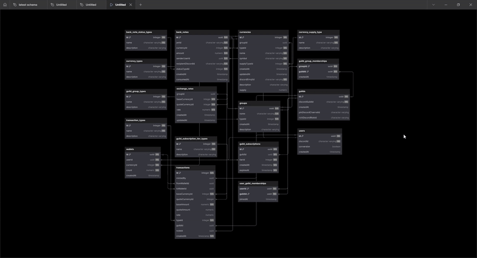
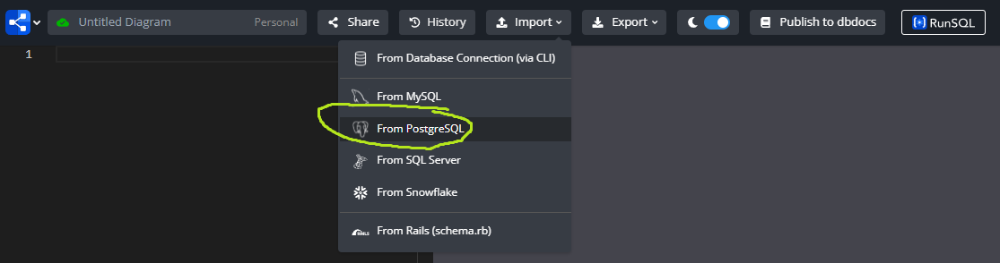
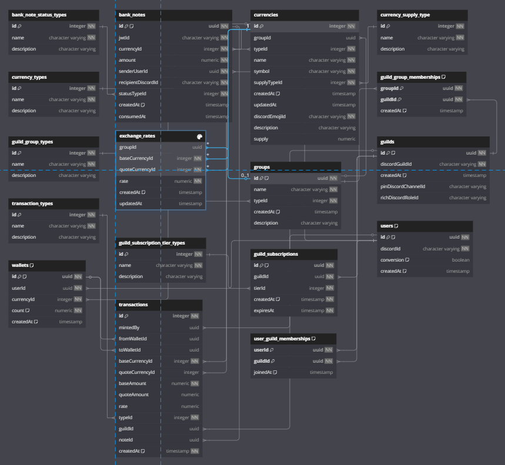
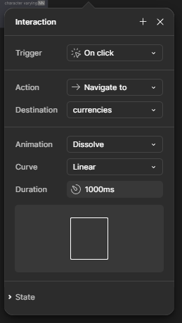

# How to create database diagram animations



## Intro

These are the technologies and programs I will be using:

- [postgresql](https://www.postgresql.org)
- [dbdiagram.io](https://dbdiagram.io)
- [figma](https://www.figma.com)

I assume you have a postgresql database up and running with at least one table.

## Export postgreSQL database schema

Run this bash script, and replace the command arguments for your environment, to get your database schema.

```
pg_dump -h <host> -p <port> -d <database_name> -U <username> -s -F p -E UTF-8 -f <output_path>
```

You will get an `.sql` file as a result of this script.

## Generate database schema SVG in dbdiagram.io

1. Create a new diagram.

2. Import schema from postgresql



3. Rearange the tables to your liking



4. Export as a SVG file

## Customize diagrams and animate frames in Figma

1. Create new figma project

2. Drag and drop your SVG database schema into the project

3. Customize the look and feel of your tables

4. Duplicate SVG to create multiple frames. Create "slices" of the database to present different views of your schema. For animation to look the best between frames, keep the tables in the same position across frames.

5. Go into "prototype" mode, connect frames and define interactions between them. For example:




